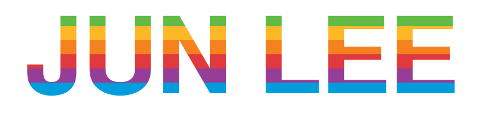

### Software Engineer · NOX

 

 

## About

Software engineer based in Australia. I love building products, shipping fast, and obsessing over the details that make software feel good to use.

 

## Tech Stack

  &nbsp;
  &nbsp;
  &nbsp;
  &nbsp;
  &nbsp;
  

 

## Experience

**Software Engineer** · NOX  
Currently shipping.

 

## Contact

  &nbsp;
  &nbsp;
  

 

